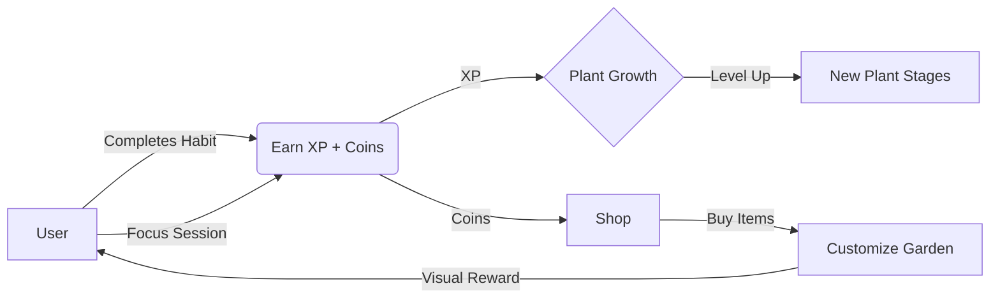

# BloomQuest

> **Gamify your life, grow your garden.**
> A full-stack gamified habit tracker built with Next.js 16, MongoDB, and Tailwind CSS.


## 📖 Project Overview

**BloomQuest** transforms personal growth into a gardening game. As users complete real-life habits, focus sessions, and daily challenges, they earn XP and Coins to nurture a virtual plant, unlock decorations, and level up their personal dashboard.

### Key Features
*   **🌱 Gamified Habits**: Complete daily habits to water your plant and earn rewards.
*   **🧘 Focus Timer**: Built-in Pomodoro timer (Focus Mode) to stay productive.
*   **⚔️ Daily Quests**: Specific challenges generated daily to keep engagement high.
*   **🛍️ Shop System**: Use earned coins to buy new pots, decorations, and backgrounds.
*   **📊 Statistics**: Visualize progress with beautiful charts and streak tracking.
*   **🔐 Secure Auth**: Complete authentication system using JWT and Bcrypt.js.
*   **🌙 Dark Mode**: Fully responsive UI with seamless dark/light mode switching.

---

## 🔄 Game Loop & Flow

The core loop of BloomQuest is designed to reinforce positive habits through immediate visual rewards.



1.  **Action**: User completes real-world tasks (Habits, Focus, Challenges).
2.  **Reward**: Immediate feedback via **XP** (Growth) and **Coins** (Currency).
3.  **Investment**: Coins are spent in the **Shop** to buy Pots, Decor, and Backgrounds.
4.  **Progression**: XP levels up the **Plant**, changing its visual stage (Seed → Sprout → Flower).

---

## 🛠️ Tech Stack

### Core
*   **Framework**: [Next.js 16](https://nextjs.org/) (App Router & Server Actions)
*   **Language**: [TypeScript](https://www.typescriptlang.org/)
*   **Styling**: [Tailwind CSS 4](https://tailwindcss.com/)
*   **Icons**: [Lucide React](https://lucide.dev/)

### Backend & Database
*   **Runtime**: Node.js (via Next.js API Routes)
*   **Database**: [MongoDB](https://www.mongodb.com/)
*   **ODM**: [Mongoose](https://mongoosejs.com/)

### Security & Auth
*   **Hashing**: `bcryptjs`
*   **Tokens**: `jsonwebtoken` (JWT)

### UI Libraries
*   **Animation**: `framer-motion`, `canvas-confetti`
*   **Components**: `radix-ui` primitives
*   **Charts**: `recharts`
*   **Theme**: `next-themes`

---

## 🚀 Getting Started

Follow these steps to set up the project locally.

### Prerequisites
*   Node.js 18+ installed
*   **MongoDB**: You must have a MongoDB instance acting running (either a local installation or a cloud Atlas cluster) for the connection string to work.

### Installation

1.  **Clone the repository**
    ```bash
    git clone https://github.com/yourusername/bloom-quest.git
    cd bloom-quest
    ```

2.  **Install dependencies**
    ```bash
    npm install
    ```

3.  **Configure Environment Variables**
    Create a `.env.local` file in the root directory and add:
    ```env
    MONGODB_URI=mongodb://localhost:27017/bloom-quest
    JWT_SECRET=your_super_secret_jwt_key_here
    ```

4.  **Run the development server**
    ```bash
    npm run dev
    ```

5.  **Open the app**
    Visit [http://localhost:3000](http://localhost:3000) in your browser.

---

## 📂 Folder Structure

A quick guide to the codebase structure:

```
src/
├── app/                  # Next.js App Router (Pages & API)
│   ├── (auth)/           # Route Group for Login/Register
│   ├── api/              # Backend API Routes (Auth, Habits, Shop, etc.)
│   ├── dashboard/        # Main Game Dashboard
│   ├── garden/           # Fullscreen Garden View
│   ├── shop/             # In-game Store
│   └── layout.tsx        # Root Layout
│
├── components/           # Reusable React Components
│   ├── dashboard/        # Dashboard-specific widgets (HabitList, Stats)
│   ├── plant/            # Dynamic Plant visualizer
│   ├── ui/               # Generic UI tokens (Buttons, Cards, Inputs)
│   └── layout/           # Navbar, Footer
│
├── lib/                  # Utilities & Configuration
│   ├── db.ts             # MongoDB Connection Helper
│   ├── auth.ts           # JWT & Password Utils
│   └── constants.ts      # Game Config (XP rates, Rewards)
│
├── models/               # Mongoose Database Schemas
│   ├── User.ts
│   ├── Habit.ts
│   └── Challenge.ts
│
└── types/                # Shared TypeScript Interfaces
    └── index.ts          # Centralized DTOs (IUser, IHabit, etc.)
```

## 📜 Scripts

*   `npm run dev`: Starts local dev server with hot-reload.
*   `npm run build`: Compiles the project for production.
*   `npm start`: Runs the production build.
*   `npm run lint`: Checks for code style issues.

---

## 🤝 Contributing


### 1. Fork & Clone
1.  **Fork** the repo on GitHub.
2.  **Clone** your fork:
    ```bash
    git clone https://github.com/YOUR_USERNAME/bloom-quest.git
    cd bloom-quest
    npm install
    ```

### 2. Create a Branch
```bash
git checkout -b feature/your-feature-name
```

### 3. Make Changes
*   Keep changes focused and coherent (one feature/fix per PR is ideal).
*   Follow existing patterns for:
    *   **API Routes**: in `src/app/api/**`.
    *   **Database Access**: use `dbConnect` from `src/lib/db.ts` and Mongoose models in `src/models/*.ts`.
    *   **UI Components & Styling**: use Tailwind CSS and customized UI components in `src/components/ui/`.
*   If you add a new model or field:
    *   Update `src/types/index.ts` to reflect the new interface.
    *   Update the Mongoose schema in `src/models/`.

### 4. Lint & Typecheck
Ideally, run the linter before committing to ensure code quality:
```bash
npm run lint
```
Fix any reported issues before opening a PR.

### 5. Open a Pull Request
When opening a PR, please include:
*   A clear title (e.g., `feat: add leaderboard`, `fix: timezone bug`).
*   A short description of:
    *   What you changed.
    *   How to test it (paths, steps, relevant env vars).

---
